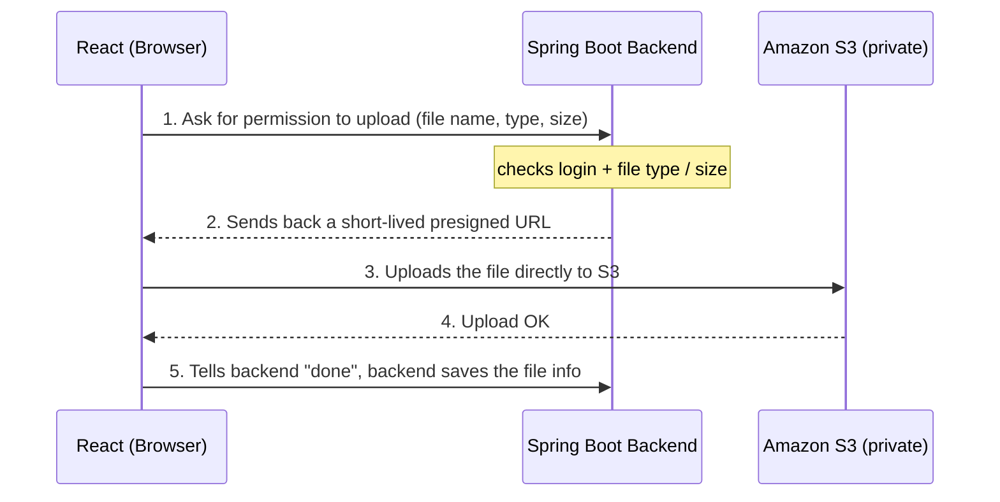

# Document Uploads — Presigned URLs vs Multipart

> **Stack:** React (frontend) · Spring Boot (backend) · Amazon S3 (storage)
> **In one line:** The browser uploads the file **straight to S3**. Spring Boot only hands out a short-lived, signed link and keeps the bucket private. This is faster, cheaper, and scales better than pushing every file through your server.

---

## 1. What Is a Presigned URL?

A presigned URL is a **temporary, signed link** that Spring Boot creates using its AWS credentials. It allows **one specific action** (like "upload this one file") for a **short time** (for example 5 minutes), and then it expires.

| The URL contains | The URL does **NOT** contain |
|---|---|
| Access Key ID, Signature, Expiry, the exact file path + action | Secret Key, IAM credentials, account access |

So even if someone sees the link, they **cannot** browse the bucket, list files, open other files, or delete anything. They can only do the single signed action — and only until it expires.

---

## 2. The Flow (React → Spring Boot → S3)

### Step-by-step in plain words

1. **React asks for permission.** When the user picks a file, the React app sends the file's name, type, and size to Spring Boot and asks "can I upload this?"

2. **Spring Boot checks and signs.** Spring Boot makes sure the user is logged in and that the file type and size are allowed. If everything is fine, it creates a short-lived presigned URL and sends it back to React. The file itself never touches the backend.

3. **React uploads straight to S3.** Using that presigned URL, the React app sends the file **directly to Amazon S3**. Your server is not in the middle, so it stays fast and lightweight.

4. **S3 stores the file.** Amazon S3 receives the file, stores it safely in the private bucket, and returns a success response to the browser.

5. **React confirms, Spring Boot saves the info.** React tells Spring Boot the upload finished. The backend records the file details (file name, where it lives in S3) so it can be shown or downloaded later.

---

## 3. Reading and Deleting Files

- **Download (Read):** When a user wants to view a file, React asks the backend, and Spring Boot returns a short-lived download link to S3. The link works for a few minutes and then expires, so files are never permanently public.

- **Delete:** Deleting is done **by the backend**, not the browser. React asks Spring Boot to delete a file, the backend checks the user is allowed, and then it tells S3 to remove it.

---

## 4. Why Presigned URLs Are Better Than Uploading Through the Backend

If every file goes **browser → Spring Boot → S3**, the file travels twice and your server does all the heavy lifting:

- **Double the network use** — a 50 MB file means 100 MB moved. With 100 users that's 10 GB through your server.
- **Heavy backend load** — every upload uses your server's CPU, memory, and bandwidth.
- **Hard to scale** — more users means more servers just to move files.
- **Slow for far-away users** — the file has to detour through your server before reaching S3.
- **Struggles with big files** — large videos or scans can overwhelm the server.
- **Higher cost** — you pay for all that extra traffic and compute.

With presigned URLs, uploads go **straight to S3**, your backend stays small and fast, and it still fully controls who is allowed to upload.

---

## 5. Presigned URL vs Multipart Upload

| Attribute | Presigned URL (direct upload) | Multipart Upload |
|---|---|---|
| **How it works** | Backend signs one link, browser uploads once | File split into parts: start → upload parts → finish |
| **Simplicity** | Very simple | More steps to manage |
| **Backend load** | Almost none | High if it goes through the server |
| **Best file size** | Up to 5 GB in one upload | Designed for huge files (up to 5 TB) |
| **Resume if it fails?** | No — must upload again | Yes — only the failed part is retried |
| **Speed for big files** | Good for normal docs | Faster for very large files (parts upload in parallel) |
| **Best for** | Most documents (PDFs, images) | Very large files (video, DICOM) or weak networks |

**Simple rule:** Use **presigned URLs** for almost everything. Use **multipart** only for very large files or shaky connections — and even then you can sign a link for each part to get the best of both.

---

## Final Recommendation

For document uploads, use **presigned URLs**. The browser uploads directly to a **private** S3 bucket, Spring Boot stays in control of who can do what, costs stay low, and it scales easily. Keep multipart in your back pocket only for very large files.
