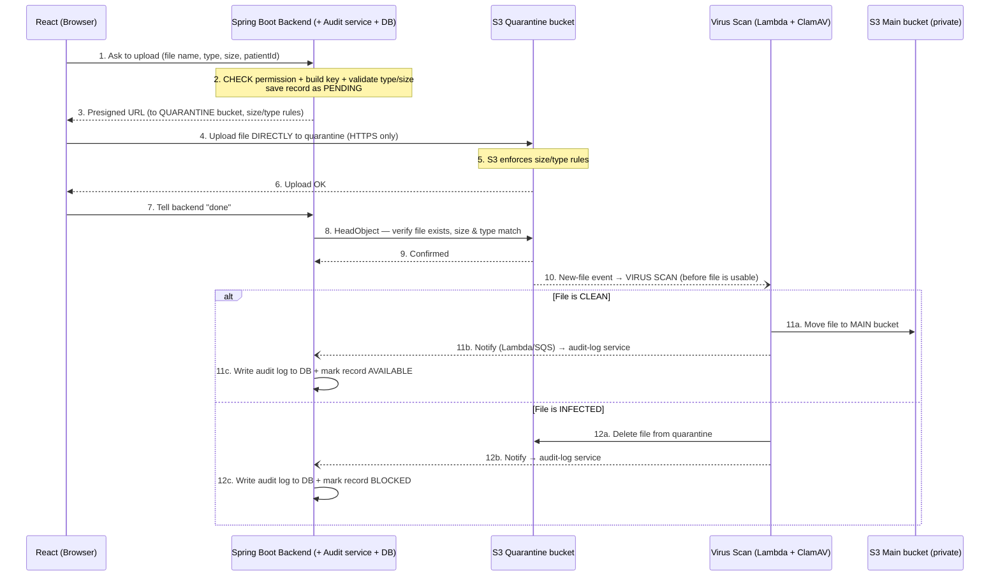

# Secure Presigned Upload Flow — How We Close Every Gap

> **Stack:** React (frontend) · Spring Boot (backend) · Amazon S3 (storage)
> **Goal of this doc:** Show the **full secure upload flow** and prove that every concern raised — wrong-folder access, file validation, **virus scan before the file is usable**, trusting the browser, versioning, TLS, and **audit log written to our own DB** — is **handled**, step by step.

---

## Key idea: scan in a quarantine bucket first

The file is **never** uploaded straight into the main bucket. It goes into a separate **quarantine (staging) bucket** first, gets **scanned there**, and **only a clean file is moved to the main bucket** and marked usable. So the main bucket only ever holds safe, scanned files. The audit log is written to **our database** by **our backend's audit-log service**, triggered by an S3 event via Lambda/SQS.

---

## The Gaps and Their Fixes (at a glance)

| # | Concern | Fix in the presigned flow |
|---|---|---|
| 1 | User could request a URL for another folder | Backend builds the key + checks permission **before** signing |
| 2a | No file size/type check | Rules added to the signed link → S3 rejects bad files |
| 2b | No virus scan | File lands in a **quarantine bucket**, scanned **before** it's moved to the main bucket |
| 2c | "Upload done" trusted from browser | Backend verifies with **HeadObject** before accepting |
| 3a | Versioning | Turn on S3 bucket versioning |
| 3b | TLS / HTTPS only | Enforce `aws:SecureTransport` bucket policy |
| 3c | Audit log | S3 event → Lambda/SQS → **our BE audit-log service → our DB** |

✅ Every gap is closed. The file is scanned **before** it becomes usable, and the file itself never routes through the backend.

---

## The Full Secure Flow (Diagram)

---

## Step-by-Step in Plain Words

**Step 1 — React asks to upload.**
The user picks a file. React sends only the basics (file name, type, size, which patient) to Spring Boot. It does **not** decide where the file is stored.

**Step 2 — Backend checks permission and builds the key.** *(closes Gap 1)*
Spring Boot reads the logged-in user's token and checks: *"Is this user allowed to upload for this patient?"*
- If **no** → stop, return an error, give **no URL**.
- If **yes** → the backend itself builds the storage path (`tenant-id/patient-id/file`) and saves the record as **PENDING**. The browser never picks the folder, so it can never target someone else's.

**Step 3 — Backend signs a URL with rules (pointing at the quarantine bucket).** *(closes Gaps 2a + 2b)*
The backend creates a short-lived presigned URL with **rules** (max size, allowed types) — but it points to the **quarantine bucket**, not the main one. So nothing reaches the real storage yet.

**Step 4 — React uploads straight to the quarantine bucket over HTTPS.** *(closes Gap 3b)*
React uploads the file **directly to the quarantine bucket** using the signed URL. The bucket policy allows **HTTPS only**, so the transfer is always encrypted. The file never passes through the backend.

**Step 5 — S3 enforces the size/type rules.** *(closes Gap 2a)*
If the file breaks the rules from Step 3, **S3 rejects it** — it's never stored.

**Step 6 — Quarantine confirms the upload** back to the browser.

**Step 7 — React tells the backend "done."**
We will **not** simply trust this message.

**Step 8–9 — Backend verifies with HeadObject.** *(closes Gap 2c)*
The backend asks the quarantine bucket directly: *"Does this file actually exist? Is its size and type correct?"* (the HeadObject call). A lying or failed browser can't fake a successful upload.

**Step 10 — Virus scan runs BEFORE the file is usable.** *(closes Gap 2b)*
The new file in the quarantine bucket fires an event that triggers a **Lambda running ClamAV**. The file is still in quarantine — **no one can use it yet** — so we check it *before* it ever reaches the main bucket.

**Step 11 — If clean → move + audit + make available.** *(closes Gap 3c)*
- **11a:** The Lambda **moves the file to the main bucket**.
- **11b:** A Lambda/SQS event **notifies our backend's audit-log service**.
- **11c:** The backend **writes an audit entry in our DB** (who, what, when, result) and marks the record **AVAILABLE**. Only now can the file be shown or downloaded.

**Step 12 — If infected → delete + audit + block.**
- **12a:** The file is **deleted from quarantine** (it never reaches the main bucket).
- **12b:** A Lambda/SQS event **notifies our audit-log service**.
- **12c:** The backend **writes an audit entry in our DB** and marks the record **BLOCKED**.

---

## Two More Settings (set once on the bucket)

- **Versioning** *(closes Gap 3a):* turn on S3 bucket versioning so changed/deleted files can be recovered — important for compliance.
- **Private buckets:** Block Public Access is on for **both** quarantine and main buckets, so the only way in/out is through our signed, short-lived URLs. A raw S3 link returns **403 Forbidden**.

---

## Why This Still Beats Routing the File Through the Backend

The backend **does** talk to S3 in this flow (signing, HeadObject, audit) — but those are **tiny control messages**, not the file:

| Backend ↔ S3 / Lambda here | Size |
|---|---|
| Sign URL | a signature, no file traffic |
| HeadObject | a few KB of metadata |
| Audit notification | automatic, tiny event |

The actual file (could be MBs or GBs) always goes **browser → S3 directly**, and is scanned in quarantine by Lambda — never moved through our server. Routing the file through the backend (`multipart/form-data` proxy) would push **every byte** through our server — the load we're avoiding. For very large files we'd use **presigned multipart** (sign each part, still direct to S3).

---

## Summary

✅ Wrong-folder access — backend builds key + checks permission
✅ Size/type — rules on the signed link, enforced by S3
✅ Virus scan — done in **quarantine, before** the file reaches the main bucket
✅ Browser trust — backend verifies with HeadObject
✅ Versioning — S3 setting
✅ TLS/HTTPS — bucket policy
✅ Audit log — S3 event → Lambda/SQS → **our BE audit-log service → our DB**

**Every gap is closed, the file is scanned before it's usable, the audit log lives in our own DB — and the file still uploads directly to S3, so we keep the security *and* the scalability.**
